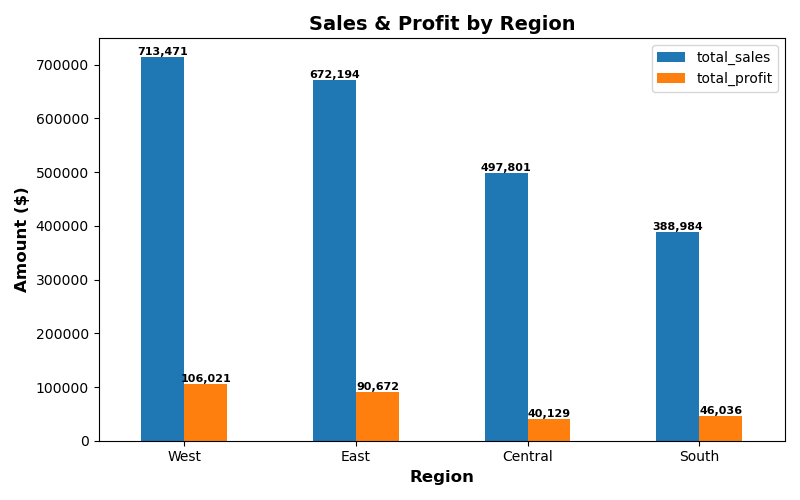
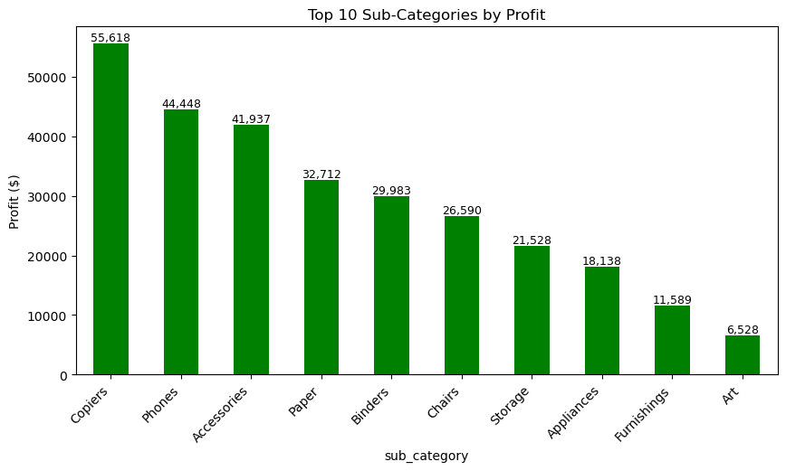
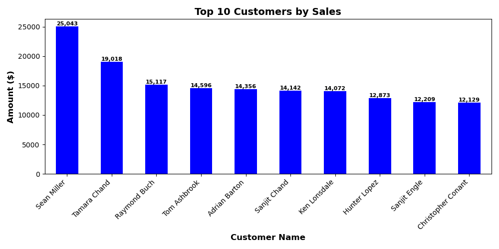
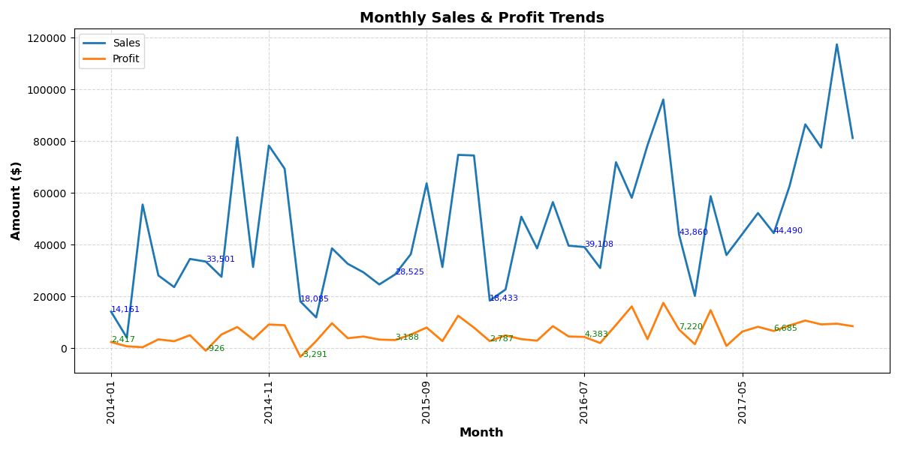

# 📊 Superstore Sales & Profit Analysis  
**Author:** Emmanuel Daraja | Data Analyst Portfolio  

---

## 📚 Table of Contents
- [🔍 Project Overview](#-project-overview)  
- [📸 Executive Summary (Lesson 1)](#-executive-summary-lesson-1)  
- [📑 Case Study PDF](#-case-study-pdf)  
- [📈 Excel + Python Analysis (Lesson 1)](#-excel--python-analysis-lesson-1)  
- [🗄 SQL + Python Analysis (Lesson 2)](#-sql--python-analysis-lesson-2)  
- [📑 Key Findings](#-key-findings)  
- [💡 Business Recommendations](#-business-recommendations)  
- [📂 Deliverables](#-deliverables)  
- [📌 About](#-about)  

---

## 🔍 Project Overview
This project explores **sales and profitability patterns** in the Superstore dataset using **Excel, Python, and MySQL**.  
It demonstrates how data analysis can move from **spreadsheet exploration → database queries → Python-powered storytelling**, resulting in **executive-ready insights**.  

---

## 📸 Executive Summary (Lesson 1)
A single-slide insight designed for executives:  
  
[📥 Download PowerPoint Slide](Sales_Analysis.pptx)

---

## 📑 Case Study PDF
For a recruiter-friendly one-page summary of this project:  
[📥 Download Case Study PDF](Superstore_Case_Study_Emmanuel_Daraja.pdf)  

---

## 📈 Excel + Python Analysis (Lesson 1)

### Excel Deliverables
- Built **pivot tables & charts** to analyze sales and profit by region, category, and segment.  
- Created **business-friendly visuals** for direct consumption.  

### Python Deliverables
- Used `pandas` and `matplotlib` to **replicate Excel insights programmatically**.  
- Generated reproducible charts and reports.  

📊 **Sample Visuals (Lesson 1):**  
  
*The West dominates sales & profit compared to other regions.*  

  
*Technology is the most profitable category, while Furniture struggles with low margins.*  

---

## 🗄 SQL + Python Analysis (Lesson 2)

In Lesson 2, I extended the analysis into **MySQL + Python integration** to show how real analysts query and visualize data directly from a relational database.  

### ❓ Business Questions Answered
1. Which region drives the most sales & profit?  
2. Which categories and sub-categories are most profitable?  
3. Who are the top 10 customers by lifetime sales?  
4. Which regions have the highest profit margins?  
5. What are the top 10 most profitable products?  
6. How do sales & profit trend over time (monthly)?  

---

### 📈 SQL Insights & Visuals

#### **Sales & Profit by Region**
The **West region dominates sales and profit**, while Central and South lag.  
  

#### **Profit by Category**
**Technology** leads in profitability, followed by Office Supplies.  
Furniture has the weakest margins.  
  

#### **Profit by Sub-Category**
Top performers: **Copiers, Phones, Accessories**.  
Weak performers: **Art, Furnishings**.  
  

#### **Top 10 Customers**
A handful of customers (led by **Sean Miller**) generate a disproportionate share of sales.  
  

#### **Monthly Sales & Profit Trends**
Clear **seasonal spikes in Q4** with occasional dips from discounting.  
  

---

## 📑 Key Findings
- The **West region** consistently outperforms all others.  
- **Technology** is the most profitable category.  
- **Furniture drags profitability** with weak margins.  
- **Customer concentration** is high — top buyers contribute disproportionately.  
- **Sales are seasonal**, peaking in Q4 every year.  

---

## 💡 Business Recommendations
- Double down on **Technology sales** and **West region expansion**.  
- **Re-negotiate supplier contracts** or adjust pricing to fix Furniture margins.  
- Launch **customer loyalty programs** for top buyers.  
- Improve **inventory planning** for seasonal Q4 demand spikes.  

---

## 📂 Deliverables
### Lesson 1
- `Superstore_Analysis.xlsx` → Excel pivot tables & charts  
- `Superstore_Analysis.ipynb` → Python notebook (Excel replication)  
- `Superstore_Analysis.html` → Exported notebook report  
- `Sales_Analysis.pptx` → Executive summary slide  
- `Superstore_Case_Study_Emmanuel_Daraja.pdf` → Case study PDF  

### Lesson 2
- `Superstore_SQL_Analysis.ipynb` → MySQL + Python notebook  
- `sql/queries.sql` → All MySQL queries  
- `images/` → SQL-based chart exports  

---

## 📌 About
This project is part of my **Data Analyst Portfolio**.  
It showcases how to analyze the same dataset across **Excel, Python, and SQL**, then deliver polished insights for both technical and business audiences.  

📍 Goal: Build one of the **best end-to-end analytics portfolios internationally**.  

© 2025 Emmanuel Daraja | Data Analyst Portfolio  
