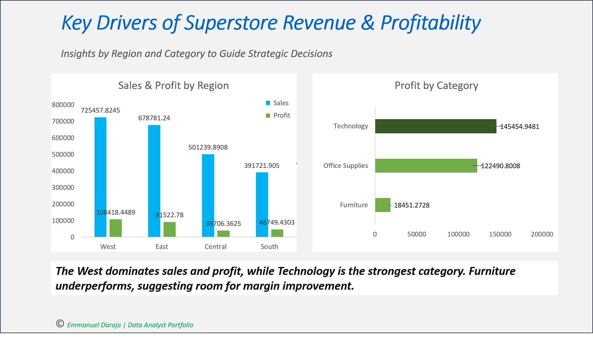
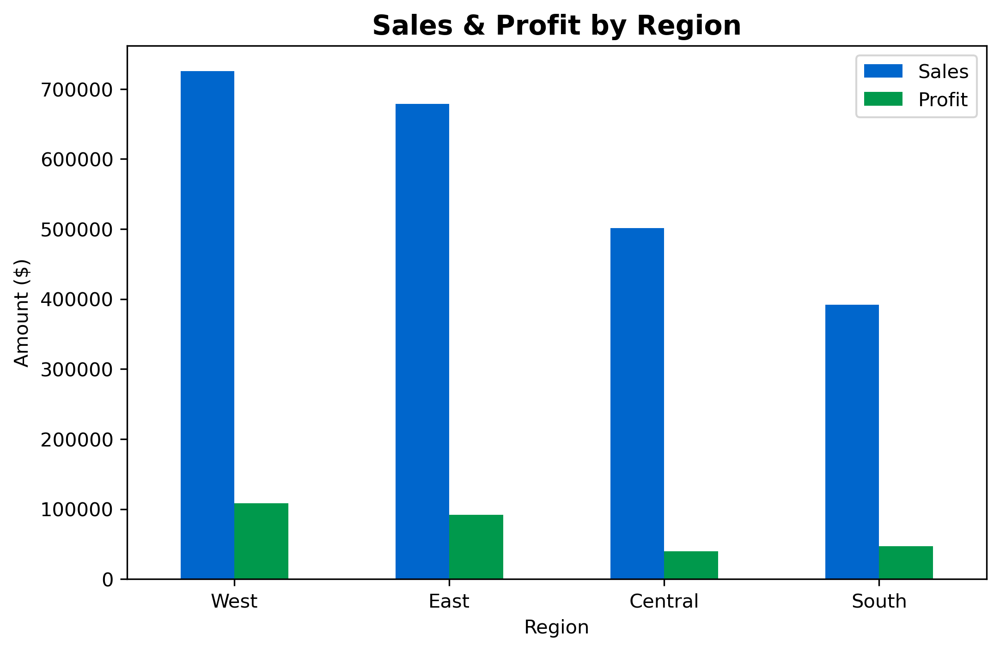

# 📊 Superstore Sales & Profit Analysis  
**Author:** Emmanuel Daraja | Data Analyst Portfolio  

---

## 🔍 Project Overview
This project explores **sales and profitability patterns** in the Superstore dataset using **Excel** and **Python**.  
It demonstrates dual-method analysis for **data storytelling**, with an **executive summary slide** for stakeholders.  

---

## 📸 Executive Summary Slide
  
[📥 Download PowerPoint Slide](Sales_Analysis.pptx)

---

## 📑 Case Study (Download)
For a recruiter-friendly one-page summary of this project:  
[📥 Download Case Study PDF](Superstore_Case_Study_Emmanuel_Daraja.pdf)

 
## 📂 Deliverables
- 📈 [Excel Analysis](Superstore_Analysis.xlsx): Pivot tables & charts for Sales & Profit  
- 🐍 [Jupyter Notebook](Superstore_Analysis.ipynb): Reproducible analysis with pandas & matplotlib  
- 🌐 [HTML Report](Superstore_Analysis.html): Shareable notebook export  
- 🖼 [Executive Summary Slide](Sales_Analysis.pptx): Business-ready, one-slide insight  
- 📊 [Dataset](Superstore_dataset.csv): Superstore data source  

---

## 📊 Key Insights
- The **West region** dominates both sales and profit.  
- **Technology** is the most profitable category.  
- **Furniture** underperforms, suggesting margin improvement opportunities.  

---

## 🛠 Tools Used
- Excel (PivotTables, Charts)  
- Python (`pandas`, `matplotlib`)  
- PowerPoint (executive summary design)  

---

## 📸 Sample Visuals

  
*The West dominates sales & profit compared to other regions.*

  
*Technology is the most profitable category, while Furniture struggles with low margins.*

---

## 📌 About
This project is part of my **Data Analyst Portfolio**.  
It showcases how the same dataset can be explored in **Excel** and **Python**, then summarized for executives in a **single insight slide**.  

© 2025 Emmanuel Daraja | Data Analyst Portfolio
